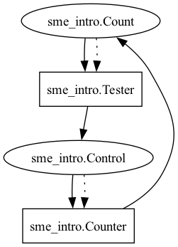
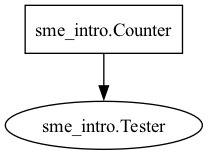
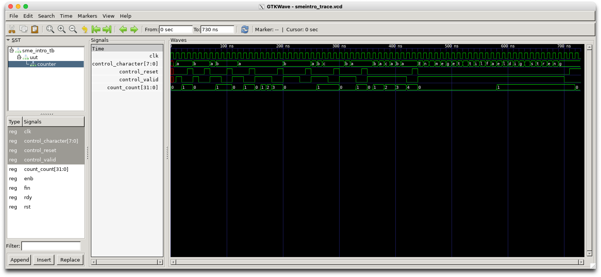

# SME intro
This project serves as an intro to SME. It is a simple project that demonstrates how to use SME to create a simple digital circuit.

## Initial setup
To get started, you need to have .NET SDK installed, which is downloaded [here](https://dotnet.microsoft.com/download).

Then you need to have SME cloned somewhere. It could be fetched through Nuget, but for this project, we will use the local version of SME, so we can easily debug it, and we will ensure that it is using the latest version. In this example, we will assume that SME is cloned into `~/git/sme`.
```
git clone git@github.com:kenkendk/sme.git ~/git/sme
```

Then, to create a new project, you can use the `dotnet new` command. In this example, we will create a new console application located in `~/tmp/sme_intro`.
```
mkdir -p ~/tmp
cd ~/tmp
dotnet new console -n sme_intro
```

Finally, to add SME to the project, you need to add a reference to the SME project file. This is done using the `dotnet add` command. SME has a few packages that are needed (`SME`, `SME.AST`, `SME.Components`, `SME.GraphViz` and `SME.VHDL`). The `SME` package depends on the others (except `SME.VHDL` and `SME.GraphViz` which are optional for VHDL generation and graph visualization, respectively).
```
dotnet add reference ../sme/src/SME/SME.csproj
dotnet add reference ../sme/src/SME.AST/SME.AST.csproj
dotnet add reference ../sme/src/SME.Components/SME.Components.csproj
dotnet add reference ../sme/src/SME.GraphViz/SME.GraphViz.csproj
dotnet add reference ../sme/src/SME.Tracer/SME.Tracer.csproj
dotnet add reference ../sme/src/SME.VHDL/SME.VHDL.csproj
```
(note: they can also be manually added to the `.csproj` file, instead of using the commandlines)

Following these steps, we have a bunch of new files in the `sme_intro` folder. The most important ones are `Program.cs` and `sme_intro.csproj`. The `Program.cs` file contains the code for the application and the `sme_intro.csproj` file contains the project configuration.

## Creating a simple circuit
In the spirit of regular expressions, we will create a simple circuit that counts the number of `'a'` characters in a string. The circuit will have a single input and a single output. It consumes one character each clock cycle, and when the input is `'a'`, it will increment the counter. The output will be the count of `'a'` characters seen so far, and the counter can be reset by setting the reset input to `true`.

### Step 1: Create the bus definitions
The first step is to define the bus that will be used to communicate between the components. We will have one input bus and one output bus. The input bus will contain the character to process, a `valid` signal to indicate that the character is valid, and a `reset` signal to reset the counter. The output bus will contain the count of `'a'` characters seen so far. The `valid` signal is optional, but it is a good practice to include it, as it ensures that the input is only processed when it is valid.

We define these buses in a new file called `Buses.cs`:
```csharp
using SME;

namespace sme_intro
{
    [InitializedBus]
    public interface Control : IBus
    {
        public bool Valid { get; set; }
        public bool Reset { get; set; }
        public byte Character { get; set; }
    }

    [InitializedBus]
    public interface Count : IBus
    {
        public uint Count { get; set; }
    }
}
```
The `InitializedBus` attribute is used to indicate that the bus should be initialized to a default value when the circuit is reset. This is useful for ensuring that the circuit starts in a known state.

### Step 2: Creating the circuit
The next step is to create the circuit. We will create a new file called `Counter.cs` that contains the circuit definition. We start by defining the class and that it is a `SimpleProcess`:
```csharp
using SME;

namespace sme_intro
{
    [ClockedProcess]
    public class Counter : SimpleProcess
    {
```
A simple process is a process that runs on every trigger, and it is the most common type of process in SME. The `ClockedProcess` attribute is used to indicate that the process trigger is the clock signal. This means that the process will run on every clock cycle. If the process doesn't have this attribute, it will be triggered when all of its inputs are ready during a clock cycle. In effect, they will still be triggered every clock cycle, but this behavior is used to trigger multiple processes within a single clock cycle.

We then define the input and output buses as fields in the class. A bus in SME is bound to a bus instance. How the buses are instantiated is not strictly standardized, but to avoid multiple processes writing to the same bus (this is allowed, as long as they don't write to the same fields, but is a common source of bugs) we will have each process create its own output bus.

```csharp
        [InputBus]
        public Control control;

        [OutputBus]
        public Count count = Scope.CreateBus<Count>();
```
The `InputBus` and `OutputBus` attributes are used to indicate the direction of the buses with respect to the current process. The `Scope.CreateBus` method is used to create a new bus instance. The buses need to be `public` to be accessible from the outside when connecting the processes.

We then define the logic of the process. In this case, we will use a simple `if` statement to check if the input is valid and if the reset signal is set. If the reset signal is set, we will reset the counter. If the input is valid, we will increment the counter if the input character is `'a'`. We then assign the counter to the output bus.

```csharp
        private uint internal_count = 0;

        protected override void OnTick()
        {
            if (control.Reset)
            {
                internal_count = 0;
            }
            else if (control.Valid && control.Character == 97) // 97 is the ASCII code for 'a'
            {
                internal_count++;
            }
            count.Count = internal_count;
        }
    }
}
```

### Step 3: Creating the test process
The next step is to create a test process that will drive the circuit. We will create a new file called `Tester.cs`, which will feed the counter with a couple of string samples and check the output. The definition is slightly different, as we need tighter control of the behavior of this process. We are using the type `SimulationProcess` instead of `SimpleProcess`, which tells SME that this process only exists during software simulation and is not being emitted to hardware. Because of this, we are free to use whatever .NET features we want, as we are not bound by the constraints of hardware. A `SimulationProcess` is implicitly a clocked process.
```csharp
using SME;

namespace sme_intro
{
    public class Tester : SimulationProcess
    {
        [InputBus]
        public Count count;

        [OutputBus]
        public Control control = Scope.CreateBus<Control>();
```

Then we define a few test strings and a method to run the test. The `Run()` method defines the driving and verification part of the simulation. For each test, it will send each character in the string to the counter. Once the string has been sent, we wait an additional clock cycle, which allows the counter to propagate through the network, allowing us to assert that the count is as expected. We then reset the counter and repeat the process for the next test string. Note the initial clock cycle for initializing the network - this is a common pattern in SME but is not strictly required.
```csharp
        public override async System.Threading.Tasks.Task Run()
        {
            await ClockAsync();
            var tests = new string[] { "a", "b", "ab", "ba", "aaa", "bbb", "abc", "cba", "abacaba", "En meget tilfældig streng" };
            foreach (var test in tests)
            {
                for (int i = 0; i < test.Length; i++)
                {
                    control.Character = (byte)test[i];
                    control.Valid = true;
                    control.Reset = false;
                    await ClockAsync();
                }
                control.Valid = false;
                await ClockAsync();
                System.Diagnostics.Debug.Assert(count.Count == test.Count(c => c == 'a'),
                    $"Count of 'a' in '{test}' is {count.Count}, expected {test.Count(c => c == 'a')}");
                control.Reset = true;
                await ClockAsync();
            }
            Console.WriteLine("All tests passed"); // Otherwise, they would have hit the assert.
        }
    }
}
```

### Step 4: Connecting the processes
The final step is to connect the processes. This is done in the `Program.cs` file. We start by creating a new instance of the `Simulation`, then instantiate the processes and connect them. We then run the simulation and wait for it to complete.
```csharp
using SME;

namespace sme_intro
{

    class Program
    {
        static void Main(string[] args)
        {
            using (var sim = new Simulation())
            {
                var tester = new Tester();
                var counter = new Counter();

                tester.count = counter.count;
                counter.control = tester.control;

                sim.Run();
            }
        }
    }

}
```

### Step 5: Running the simulation
To run the simulation, it is simply this command:
```
dotnet run
```
Which should produce the following output:
```
All tests passed
```

## Further SME tools

### Generating connectivity graphs
SME can draw the processes, their buses and how they're connected using GraphViz. This is done by adding `.BuildGraph()` on `sim` before `.Run()`:
```csharp
                sim
                    .BuildGraph()
                    .Run();
```
This creates a `.dot` file in the `output` folder. This can be saved as a PNG using
```
dot -Tpng output/network.dot -o with_buses.png
```
Producing this image:



It's not a problem for this particular graph, but it can become cluttered with the buses also being rendered explicitly as circles. We can instead turn off the buses, and only have the processes shown:
```
                    .BuildGraph(render_buses: false)
```
Which produces this graph:



### Generating VHDL
The most useful part of SME (because this is what it is targeting) is its capability to generate hardware definitions in VHDL.
To do this, there are a few requirements:
1. The processes to be emitted have to be in the allowed subset of C# (the VHDL renderer will tell you this).
2. The simulation needs to know which buses are the top-level buses: i.e. which buses are the global input and output of the network. (For this example, it's all of the buses, but more complex networks could leverage the compositionality of SME, and have a lot of internal buses).
3. A trace file should be generated for later testing. During software simulation, SME will capture every value on every bus at every clock cycle. This trace file is then used to a) drive the resulting hardware model, and b) verify that the generated hardware is clock cycle accurate to the software simulation, given the exact same input.

These requirements are filled partly by the implementation and by these calls:
```csharp
                sim
                    .AddTopLevelInputs(counter.control)
                    .AddTopLevelOutputs(counter.count)
                    .BuildGraph(render_buses: false)
                    .BuildCSVFile()
                    .BuildVHDL()
                    .Run();
```
If we then run the network, we will see that output becomes populated with a lot of files:
```
output
├── network.dot
├── trace.csv
└── vhdl
    ├── Counter.vhdl
    ├── Export_sme_intro.vhdl
    ├── Makefile
    ├── TestBench_sme_intro.vhdl
    ├── Types_sme_intro.vhdl
    ├── csv_util.vhdl
    ├── sme_intro.vhdl
    ├── sme_intro.xpr
    └── system_types.vhdl
```
The only file to worry about is the process definitions. In this network, there's only one process (`Counter.vhdl`), but we can look at whether it resembles the corresponding SME process, which it does around line 76:
```vhdl
        elsif rising_edge(CLK) then

            if control_Reset = '1' then
                internal_count := TO_UNSIGNED(0, 32);
            else
                if (control_Valid = '1') and (control_Character = TO_UNSIGNED(97, 8)) then
                    internal_count := internal_count + TO_UNSIGNED(1, 32);
                end if;
            end if;
            count_Count <= internal_count;

            FIN <= not RDY;
        end if;
```
To run the trace file against the VHDL implementation, run it through GHDL locally (if installed locally):
```
cd output/vhdl
make
```
Or through docker (if GHDL is not locally installed):
```bash
docker run -t -v ./output:/mnt/data ghdl/ghdl:ubuntu20-mcode /bin/bash -c "cd /mnt/data/vhdl; make; ret=$?; rm -r work; exit $ret"
```
Which should produce the following output:
```
ghdl -a --std=93c --ieee=synopsys --workdir=work --warn-no-others system_types.vhdl
ghdl -a --std=93c --ieee=synopsys --workdir=work --warn-no-others Types_sme_intro.vhdl
ghdl -a --std=93c --ieee=synopsys --workdir=work --warn-no-others Counter.vhdl
ghdl -a --std=93c --ieee=synopsys --workdir=work --warn-no-others csv_util.vhdl
ghdl -a --std=93c --ieee=synopsys --workdir=work --warn-no-others sme_intro.vhdl
ghdl -a --std=93c --ieee=synopsys --workdir=work --warn-no-others TestBench_sme_intro.vhdl
ghdl -e --std=93c --ieee=synopsys --workdir=work --warn-no-others sme_intro_tb
ghdl -r --std=93c --ieee=synopsys --workdir=work --warn-no-others sme_intro_tb --vcd=trace.vcd
TestBench_sme_intro.vhdl:180:13:@715ns:(report note): completed successfully after 72 clockcycles
ghdl -a --std=93c --ieee=synopsys --workdir=work --warn-no-others Export_sme_intro.vhdl
```
Indicating that the simulation went as expected (otherwise it would fail before reaching "completed successfully").

Finally, the VHDL simulation also produces a trace file, which can be viewed using a waveform viewer (such as GTKWave (although it doesn't seem to work on OSX >= 14)). But it can be viewed using the VScode extension "wavetrace" although it is also buggy. A trace viewed in GTKWave looks like this:


## The next step
While not important (as these next steps take an enormous amount of time), the next steps would be
1. Create an AMD (Xilinx) Vivado project.
2. Synthesize the design. (potentially takes minutes).
3. Verify that the synthesized design exists.
Create a driver/interface between the host and hardware design.
5. Synthesize interface + hardware design.
6. Place & route design (potentially takes hours). This provides performance metrics.
7. Create a software driver for interfacing with the hardware.
8. Run the final design.